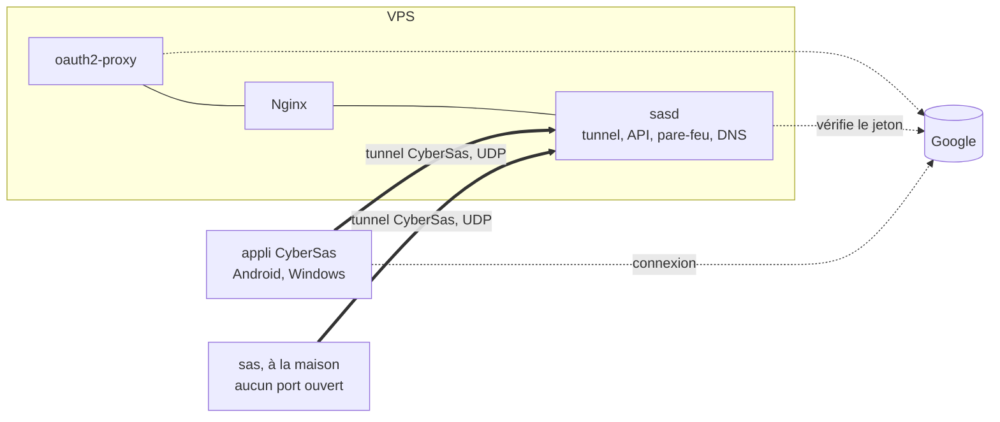

# CyberSas

Mon propre VPN, de bout en bout : le protocole du tunnel, le serveur, les
applis. Une connexion par compte Google, une seule porte vers Internet, et
rien d'autre d'ouvert.

> **En cours.** Le serveur, le tunnel et le client Linux tournent dans le labo
> et passent leurs vérifications. Les applis Android et Windows arrivent.

## Pourquoi

Héberger un service chez soi, c'est d'habitude ouvrir des ports sur sa box et
laisser son adresse IP à la vue de tous. Partager un serveur avec quelques
personnes, c'est souvent un mot de passe commun qui circule par message.

Tailscale règle ça très bien, mais c'est leur serveur, leur appli et leur
protocole. CyberSas est l'exercice inverse : tout écrire soi-même, sauf les
primitives cryptographiques, que personne de sérieux n'écrit.

- **Un seul point d'entrée public**, sur un petit VPS.
- **Un VPN pour l'équipe.** Chacun le rejoint avec son compte Google. Aucun mot
  de passe n'est créé, stocké ni partagé ici.
- **Aucun port ouvert à la maison.** Le serveur de la maison sort vers le VPS
  par le tunnel, et c'est par là qu'on l'atteint.

## Ce qu'il y a dedans



- **Le protocole du tunnel**, [`internal/noise`](internal/noise) et
  [`internal/tunnel`](internal/tunnel). Une poignée de main Noise IK, écrite
  d'après la spécification et vérifiée contre une implémentation de référence,
  puis des sessions chiffrées en ChaCha20-Poly1305, renouvelées toutes les deux
  minutes, protégées contre le rejeu. Tout est décrit dans
  [`docs/protocole.md`](docs/protocole.md).
- **sasd, le serveur** ([`cmd/sasd`](cmd/sasd)). Il fait tourner le tunnel,
  inscrit les appareils par une API HTTPS, applique les règles d'accès avec
  nftables et répond aux noms du réseau (`maison.sas.internal`).
- **sas, le client Linux** ([`cmd/sas`](cmd/sas)), pour les machines sans écran
  comme le serveur de la maison.
- **Les applis Android et Windows**, en Flutter, avec le même moteur de tunnel.
  À venir.
- **Nginx et oauth2-proxy**, pour publier un service de la maison sur une page
  web, protégée par la même connexion Google.

## Comment ça marche

1. Dans l'appli, on se connecte avec Google.
2. L'appli génère sa paire de clés. La clé privée ne quitte jamais l'appareil.
3. Elle envoie à sasd le jeton Google et la clé publique. sasd vérifie le jeton
   auprès de Google, puis que l'adresse figure dans la liste de l'équipe.
4. sasd attribue une adresse dans le réseau, `10.77.0.x`, et rend sa propre clé
   publique.
5. L'appli ouvre le tunnel. À partir de là, Google et l'API ne servent plus à
   rien : le tunnel ne se fie qu'aux clés.

Une machine sans écran s'inscrit avec une clé à usage unique donnée par
l'admin, au lieu d'un compte Google.

## Qui peut aller où

Tout le trafic entre appareils passe par sasd, qui applique
[`politique/politique.json`](politique/politique.json) dans le pare-feu du
noyau. Tout est fermé par défaut :

- les admins atteignent tout ;
- chacun atteint ses propres appareils, pas ceux des autres ;
- l'équipe atteint les services web de la maison, pas son SSH ;
- la maison ne peut se retourner vers personne.

## Essayer le labo

Il faut Docker et Bash (Git Bash suffit sous Windows).

```bash
cp .env.exemple .env            # y mettre son adresse Google dans ADMIN_EMAIL
bash scripts/sas.sh init        # secrets, autorité du labo, liste d'accès
bash scripts/sas.sh demarrer    # construit et lance le serveur
bash scripts/sas.sh labo        # une fausse maison et un poste d'essai
bash scripts/sas.sh essai       # vingt vérifications, de bout en bout
```

L'essai vérifie entre autres que :
- un faux jeton Google, une clé d'inscription inventée ou déjà utilisée, et une
  clé publique faible sont refusés ;
- le poste atteint le service web de la maison, mais pas son autre port ;
- la maison ne peut pas se retourner vers le poste ;
- un appareil retiré est coupé dans les secondes qui suivent ;
- après un redémarrage du serveur, les appareils reviennent seuls.

Les tests du protocole se lancent à part : `go test -race ./...`.

## Ajouter ou retirer quelqu'un

```bash
bash scripts/sas.sh membre alice@gmail.com equipe
bash scripts/sas.sh retirer alice@gmail.com
```

Retirer quelqu'un coupe ses appareils en cinq secondes au plus.

Pour une machine sans écran :

```bash
docker compose exec sasd sasd cle --etiquette maison
# puis, sur la machine :
sas rejoindre --serveur https://vpn.<domaine> --cle sas-... --nom maison
sas demon
```

## Brancher Google

Dans la [console Google Cloud](https://console.cloud.google.com/apis/credentials),
créer un ID client OAuth de type **Application Web**, avec comme URI de
redirection `https://auth.<domaine>/oauth2/callback`, puis :

```bash
bash scripts/sas.sh google <id>.apps.googleusercontent.com <secret>
```

Les applis utiliseront ce même identifiant pour obtenir leur jeton.

## Les limites, franchement

Elles sont détaillées dans [`docs/menaces.md`](docs/menaces.md). Les deux plus
importantes :

- **Le protocole n'est pas audité.** Il suit une architecture éprouvée et ses
  tests couvrent les attaques connues, mais pour des données vraiment
  sensibles, WireGuard reste le choix raisonnable.
- **Le serveur voit le trafic entre appareils.** Tout passe par lui, et il
  déchiffre chaque paquet avant de le rechiffrer pour le destinataire. C'est le
  prix de la simplicité, et c'est ce qui permet d'appliquer les règles d'accès
  au centre. Tailscale, qui relie les appareils en direct, n'a pas ce défaut.

## Ce qui reste à faire

- Les applis Android et Windows.
- Une protection contre l'inondation de poignées de main (les cookies de
  WireGuard).
- Let's Encrypt et le déploiement sur un VPS.
- Les journaux envoyés vers un SIEM, avec des alertes.
