<div align="center">

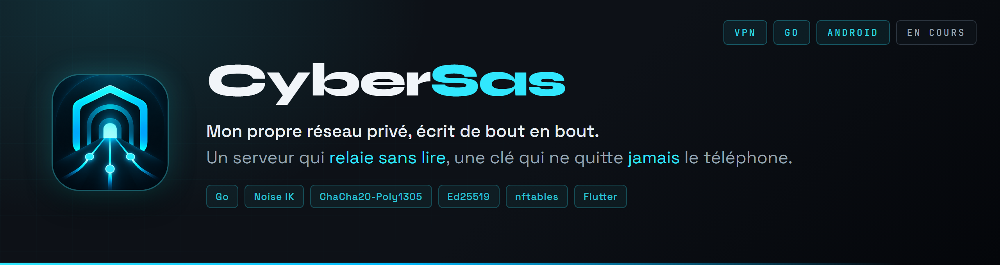

</div>

<br>

Mon propre VPN, de bout en bout : le protocole du tunnel, le serveur, les applis. Il n'ouvre aucun port à la maison, son serveur relaie des paquets qu'il ne peut pas lire, et c'est le téléphone de l'admin, avec son doigt, qui décide qui entre.

> **En cours.** Le serveur, le tunnel et le client Linux tournent dans le labo et passent leurs vérifications. L'appli Android ouvre un vrai tunnel sur le Fold, et l'admin gère le réseau depuis son téléphone. La connexion Google dans l'appli arrive. Voir [la feuille de route](#la-feuille-de-route).


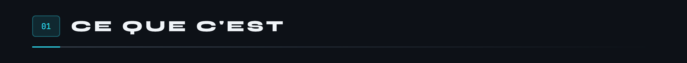

Héberger un service chez soi, c'est d'habitude ouvrir des ports sur sa box et laisser son adresse IP à la vue de tous. Partager un serveur avec quelques personnes, c'est souvent un mot de passe commun qui circule par message.

Tailscale règle ça très bien, mais c'est leur serveur, leur appli et leur protocole. CyberSas est l'exercice inverse : tout écrire soi-même, sauf les primitives cryptographiques, que personne de sérieux n'écrit.


Ce n'est pas un VPN pour naviguer caché : il relie tes appareils entre eux. Ta navigation sur Internet ne passe pas par lui.

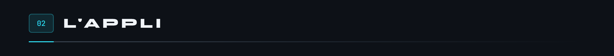

Sur le téléphone, une barre flottante en bas, et le tunnel du logo qui s'allume et s'éteint avec l'interrupteur.


Sur le Fold déplié, un rail à gauche. Toucher un appareil fait glisser la liste à gauche et ouvre son détail à droite.

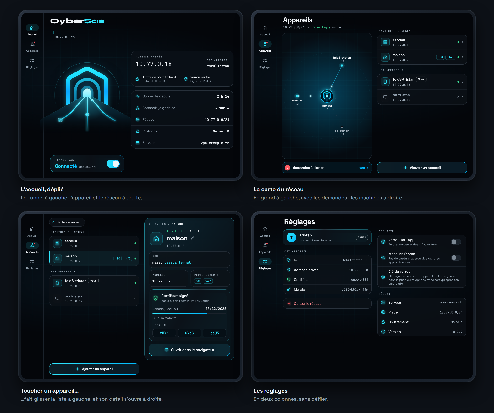

L'appli vit dans le dossier `mobile/`. Elle embarque le moteur Go du tunnel (`pont/`) et passe par le service VPN d'Android. Les captures ci-dessus viennent de son mode démo, sur un réseau d'exemple.

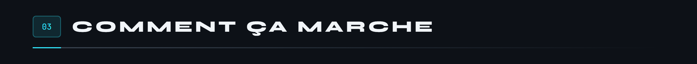


1. L'admin invite : l'appli partage un lien à usage unique, qui porte l'adresse du serveur et la clé publique du verrou. Bientôt, un compte Google de l'équipe suffira.
2. Le nouvel appareil génère sa paire de clés. La clé privée ne le quitte jamais.
3. Il s'inscrit auprès de sasd avec la preuve qu'il détient la clé privée. sasd lui attribue une adresse, `10.77.0.x`.
4. L'admin voit la demande sur son téléphone, compare l'empreinte avec celle du nouvel appareil, et signe son certificat avec son doigt.
5. L'appareil ouvre une session avec le serveur, puis une session de bout en bout avec chaque appareil qu'il a le droit de joindre, à la demande. À partir de là, l'API ne sert plus à rien : le tunnel ne se fie qu'aux clés.

Tout le protocole, octet par octet et en schémas, est dans [le document du protocole](docs/protocole.md).

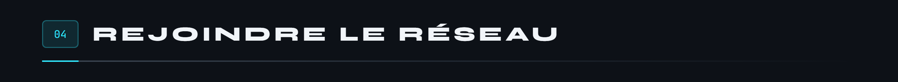


L'empreinte, ce sont les douze premiers caractères de la clé publique du nouvel appareil. Elle s'affiche des deux côtés : si elles sont identiques, personne ne s'est glissé entre les deux. Sous l'empreinte, l'admin lit ce qu'il signe : l'adresse, le groupe, la durée. Si le serveur change un seul de ces champs avant la signature, rien n'est signé.

Une machine sans écran, comme le serveur de la maison, s'inscrit avec le client Linux et une clé à usage unique donnée par l'admin.


Le verrou, sa chaîne de confiance et le coffre du téléphone ont [leur document](docs/verrou.md).

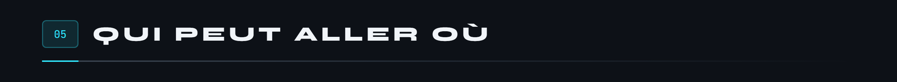

La politique vit dans `politique/politique.json`, signée par l'admin. Tout est fermé par défaut.

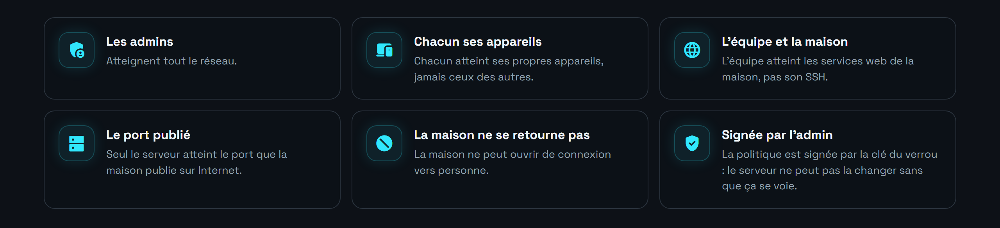

Chaque appareil applique lui-même ce qui le concerne : le serveur ne voit pas le trafic entre appareils, et ne peut pas changer les règles sans que ça se voie.

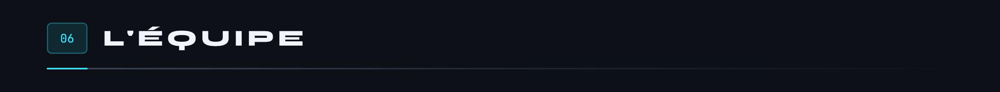

L'équipe, c'est la liste des comptes Google qui ont le droit de rejoindre le réseau, chacun dans un groupe : `admins` ou `equipe`. Le reste se fait depuis le téléphone de l'admin.



Pour l'instant, l'équipe elle-même se règle en ligne de commande :

```bash
bash scripts/sas.sh membre alice@gmail.com equipe
bash scripts/sas.sh retirer alice@gmail.com
```

Retirer quelqu'un de l'équipe coupe tous ses appareils en cinq secondes au plus.

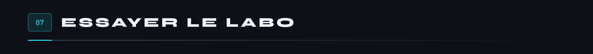

Il faut Docker et Bash (Git Bash suffit sous Windows).

```bash
cp .env.exemple .env            # y mettre son adresse Google dans ADMIN_EMAIL
bash scripts/sas.sh init        # secrets, autorité du labo, verrou, liste d'accès
bash scripts/sas.sh demarrer    # construit, signe la politique, lance le serveur
bash scripts/sas.sh labo        # une fausse maison, un poste d'essai, signés
bash scripts/sas.sh essai       # dix-huit vérifications, de bout en bout
```

L'essai vérifie entre autres que :

- une inscription sans preuve de possession est refusée ;
- le poste atteint le service de la maison, mais ni son port publié ni son port d'admin ;
- la maison ne peut pas se retourner vers le poste ;
- une capture réseau sur le serveur voit en clair ce que le serveur fait lui-même, mais jamais ce que le poste envoie à la maison ;
- un appareil que le serveur inscrit sans certificat est refusé par le poste ;
- une personne retirée de l'équipe perd ses appareils en quelques secondes ;
- après un redémarrage du serveur, les appareils reviennent seuls.

Pour inviter un téléphone : `bash scripts/sas.sh invitation <adresse Google>` donne le lien à ouvrir sur lui, puis `bash scripts/sas.sh signer <sa clé publique>` signe sa demande depuis l'ordinateur, si on ne le fait pas depuis l'appli.

Les tests du code se lancent à part : `go test -race ./...` (79 tests, dont les vecteurs officiels de Noise, et 8 cibles de fuzzing).

Pour brancher la connexion Google des pages web, créer dans la [console Google Cloud](https://console.cloud.google.com/apis/credentials) un ID client OAuth de type **Application Web**, avec comme URI de redirection `https://auth.<domaine>/oauth2/callback`, puis :

```bash
bash scripts/sas.sh google <id>.apps.googleusercontent.com   # le secret est demandé
```

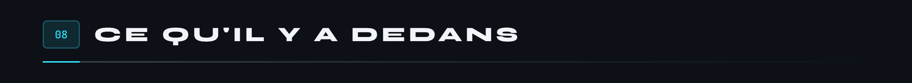


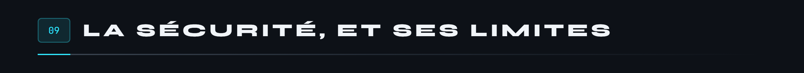

CyberSas a été relu trois fois. D'abord par trois relecteurs indépendants et une revue de sécurité : 46 constats, dont 3 hauts. Puis aux outils du métier (govulncheck, staticcheck, gosec, Semgrep, Trivy, Hadolint, ShellCheck, Gixy, fuzzing différentiel contre flynn/noise) : 10 de plus. Enfin sur l'appli et l'admin à distance : 23, dont un haut, une révocation depuis l'appli qui reprenait sans la vérifier la liste du serveur. Tout est traité, chaque fois avec son test quand c'est possible, sauf un constat accepté et expliqué.

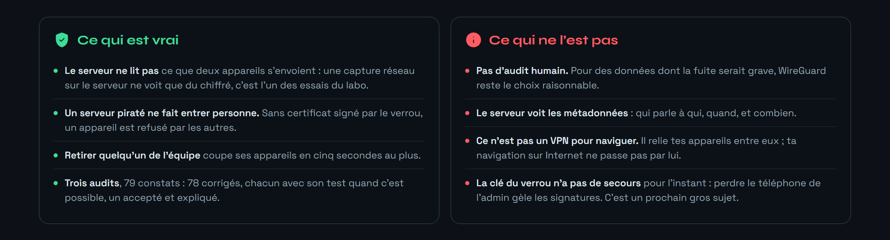

Pour aller plus loin, quatre documents, dessinés comme ce README :

<div align="center">

<a href="docs/protocole.md">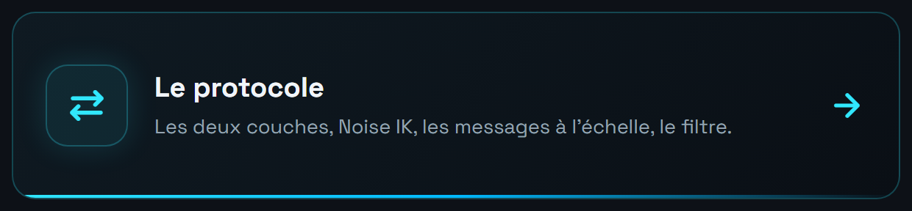</a>
<a href="docs/verrou.md"></a>
<a href="docs/menaces.md"></a>
<a href="docs/audit.md"></a>

</div>

<a name="la-feuille-de-route"></a>
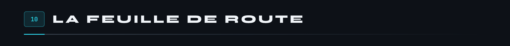


Les figures de ce README sont dessinées par les scripts de `docs/tools` : aucune ne sort d'un logiciel de dessin, et chaque animation est vérifiée image par image avant d'être publiée.

<br>

<div align="center">
<sub>Tristan Joncour · élève ingénieur en cyberdéfense à l'ENSIBS</sub>
</div>
