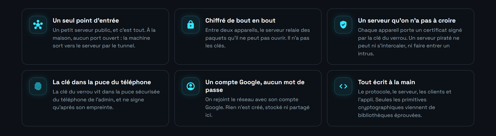
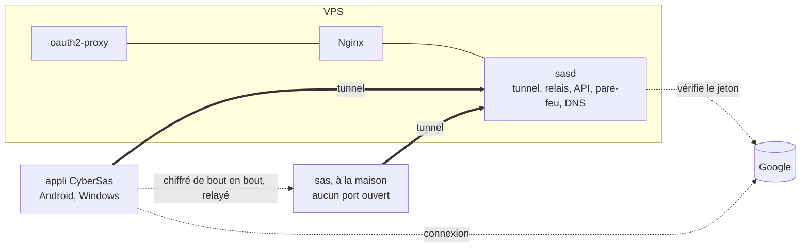
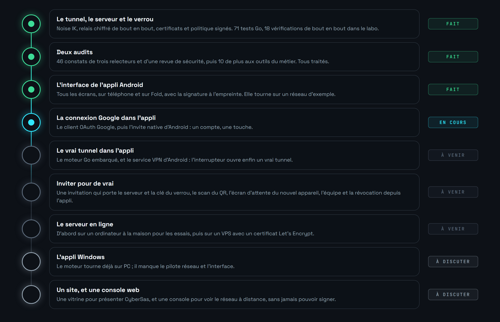

<div align="center">


</div>

<br>

Mon propre VPN, de bout en bout : le protocole du tunnel, le serveur, les applis. On le rejoint avec son compte Google, il n'ouvre aucun port à la maison, et son serveur relaie des paquets qu'il ne peut pas lire.

> **En cours.** Le serveur, le tunnel et le client Linux tournent dans le labo et passent leurs vérifications. L'appli Android a toute son interface, mais elle tourne encore sur un réseau d'exemple : le vrai tunnel arrive. Voir [la feuille de route](#la-feuille-de-route).


Héberger un service chez soi, c'est d'habitude ouvrir des ports sur sa box et laisser son adresse IP à la vue de tous. Partager un serveur avec quelques personnes, c'est souvent un mot de passe commun qui circule par message.

Tailscale règle ça très bien, mais c'est leur serveur, leur appli et leur protocole. CyberSas est l'exercice inverse : tout écrire soi-même, sauf les primitives cryptographiques, que personne de sérieux n'écrit.



Ce n'est pas un VPN pour naviguer caché : il relie tes appareils entre eux. Ta navigation sur Internet ne passe pas par lui.


Sur le téléphone, une barre flottante en bas, et le tunnel du logo qui s'allume et s'éteint avec l'interrupteur.


Sur le Fold déplié, un rail à gauche. Toucher un appareil fait glisser la liste à gauche et ouvre son détail à droite.


L'appli se construit dans [`mobile/`](mobile). Pour l'instant, elle démarre sur un réseau d'exemple : aucun vrai serveur, aucune vraie clé.


1. Dans l'appli, on se connecte avec Google.
2. L'appli génère sa paire de clés. La clé privée ne quitte jamais l'appareil.
3. Elle envoie à sasd le jeton Google, la clé publique, et la preuve qu'elle détient la clé privée. sasd vérifie le jeton auprès de Google, puis que l'adresse figure dans la liste de l'équipe.
4. sasd attribue une adresse, `10.77.0.x`. L'admin signe le certificat de l'appareil avec la clé du verrou, qu'il garde chez lui.
5. L'appareil ouvre une session avec le serveur, puis une session de bout en bout avec chaque appareil qu'il a le droit de joindre, à la demande. À partir de là, Google et l'API ne servent plus à rien : le tunnel ne se fie qu'aux clés.

Tout le protocole est décrit dans [`docs/protocole.md`](docs/protocole.md).




L'empreinte, ce sont les douze premiers caractères de la clé publique du nouvel appareil. Elle s'affiche des deux côtés : si elles sont identiques, personne ne s'est glissé entre les deux. Une machine sans écran, comme le serveur de la maison, s'inscrit avec une clé à usage unique donnée par l'admin, au lieu d'un compte Google.


Le mode d'emploi du verrou est dans [`docs/verrou.md`](docs/verrou.md).


La politique est dans [`politique/politique.json`](politique/politique.json), signée par l'admin. Tout est fermé par défaut.


Chaque appareil applique lui-même ce qui le concerne : le serveur ne voit pas le trafic entre appareils, et ne peut pas changer les règles sans que ça se voie.


L'équipe, c'est la liste des comptes Google qui ont le droit de rejoindre le réseau, chacun dans un groupe : `admins` ou `equipe`. Elle vit sur le serveur, dans `etat/equipe.txt`, et se règle en ligne de commande :

```bash
bash scripts/sas.sh membre alice@gmail.com equipe
bash scripts/sas.sh retirer alice@gmail.com
```

Retirer quelqu'un coupe ses appareils en cinq secondes au plus. Pour un appareil volé, le révoquer aussi avec la clé du verrou : [`docs/verrou.md`](docs/verrou.md).

Gérer l'équipe et révoquer un appareil depuis l'appli, c'est l'une des prochaines étapes.


Il faut Docker et Bash (Git Bash suffit sous Windows).

```bash
cp .env.exemple .env            # y mettre son adresse Google dans ADMIN_EMAIL
bash scripts/sas.sh init        # secrets, autorité du labo, verrou, liste d'accès
bash scripts/sas.sh demarrer    # construit, signe la politique, lance le serveur
bash scripts/sas.sh labo        # une fausse maison, un poste d'essai, signés
bash scripts/sas.sh essai       # dix-huit vérifications, de bout en bout
```

L'essai vérifie entre autres que :

- une inscription sans preuve de possession est refusée ;
- le poste atteint le service de la maison, mais ni son port publié ni son port d'admin ;
- la maison ne peut pas se retourner vers le poste ;
- une capture réseau sur le serveur voit en clair ce que le serveur fait lui-même, mais jamais ce que le poste envoie à la maison ;
- un appareil que le serveur inscrit sans certificat est refusé par le poste ;
- une personne retirée de l'équipe perd ses appareils en quelques secondes ;
- après un redémarrage du serveur, les appareils reviennent seuls.

Les tests du code se lancent à part : `go test -race ./...` (71 tests).

Pour brancher la connexion Google, créer dans la [console Google Cloud](https://console.cloud.google.com/apis/credentials) un ID client OAuth de type **Application Web**, avec comme URI de redirection `https://auth.<domaine>/oauth2/callback`, puis :

```bash
bash scripts/sas.sh google <id>.apps.googleusercontent.com   # le secret est demandé
```





CyberSas a été passé au crible par trois relecteurs indépendants puis par une revue de sécurité : 46 constats, dont 3 hauts, tous traités, chacun avec son test quand c'est possible. Un deuxième audit l'a ensuite passé aux outils du métier (govulncheck, staticcheck, gosec, Semgrep, Trivy, Hadolint, ShellCheck, Gixy, fuzzing différentiel contre flynn/noise) : 10 constats de plus, corrigés. Le détail est dans [`docs/audit.md`](docs/audit.md), le modèle de menace dans [`docs/menaces.md`](docs/menaces.md).


<a name="la-feuille-de-route"></a>




Les figures de ce README sont dessinées par les scripts de [`docs/tools`](docs/tools) : aucune ne sort d'un logiciel de dessin.

<br>

<div align="center">
<sub>Tristan Joncour · élève ingénieur en cyberdéfense à l'ENSIBS</sub>
</div>
