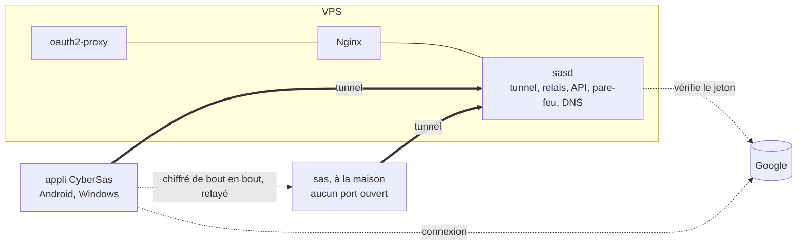

# CyberSas

Mon propre VPN, de bout en bout : le protocole du tunnel, le serveur, les
applis. Une connexion par compte Google, une seule porte vers Internet, et un
serveur qui relaie sans pouvoir lire.

> **En cours.** Le serveur, le tunnel et le client Linux tournent dans le labo
> et passent leurs vérifications. Les applis Android et Windows arrivent.

## Pourquoi

Héberger un service chez soi, c'est d'habitude ouvrir des ports sur sa box et
laisser son adresse IP à la vue de tous. Partager un serveur avec quelques
personnes, c'est souvent un mot de passe commun qui circule par message.

Tailscale règle ça très bien, mais c'est leur serveur, leur appli et leur
protocole. CyberSas est l'exercice inverse : tout écrire soi-même, sauf les
primitives cryptographiques, que personne de sérieux n'écrit.

- **Un seul point d'entrée public**, sur un petit VPS.
- **Un VPN pour l'équipe.** Chacun le rejoint avec son compte Google. Aucun mot
  de passe n'est créé, stocké ni partagé ici.
- **Chiffré de bout en bout.** Entre deux appareils, le serveur relaie des
  messages qu'il ne peut pas ouvrir.
- **Un serveur qu'on n'a pas à croire.** Avec le verrou du réseau, un serveur
  piraté ne peut ni s'intercaler, ni ouvrir un port, ni faire revenir un
  appareil banni.
- **Aucun port ouvert à la maison.** Le serveur de la maison sort vers le VPS
  par le tunnel, et c'est par là qu'on l'atteint.

## Ce qu'il y a dedans



- **Le protocole du tunnel**, [`internal/noise`](internal/noise) et
  [`internal/tunnel`](internal/tunnel). Une poignée de main Noise IK écrite
  d'après la spécification, identique octet pour octet au vecteur de test
  officiel, puis des sessions ChaCha20-Poly1305 renouvelées toutes les deux
  minutes, protégées contre le rejeu et l'inondation. Tout est décrit dans
  [`docs/protocole.md`](docs/protocole.md).
- **sasd, le serveur** ([`cmd/sasd`](cmd/sasd)). Il fait tourner le tunnel,
  relaie les messages chiffrés entre appareils, inscrit les appareils par une
  API HTTPS, applique son pare-feu avec nftables et répond aux noms du réseau
  (`maison.sas.internal`).
- **sas, le client Linux** ([`cmd/sas`](cmd/sas)), pour les machines sans écran
  comme le serveur de la maison. C'est aussi l'outil de l'admin pour le verrou.
- **La logique des clients** ([`internal/client`](internal/client)), que les
  applis Android et Windows reprendront telle quelle.
- **Nginx et oauth2-proxy**, pour publier un service de la maison sur une page
  web, protégée par la même connexion Google.

## Comment ça marche

1. Dans l'appli, on se connecte avec Google.
2. L'appli génère sa paire de clés. La clé privée ne quitte jamais l'appareil.
3. Elle envoie à sasd le jeton Google, la clé publique, et la preuve qu'elle
   détient la clé privée. sasd vérifie le jeton auprès de Google, puis que
   l'adresse figure dans la liste de l'équipe.
4. sasd attribue une adresse, `10.77.0.x`. L'admin signe le certificat de
   l'appareil avec la clé du verrou, qu'il garde chez lui.
5. L'appareil ouvre une session avec le serveur, puis une session de bout en
   bout avec chaque appareil qu'il a le droit de joindre, à la demande. À partir
   de là, Google et l'API ne servent plus à rien : le tunnel ne se fie qu'aux
   clés.

Une machine sans écran s'inscrit avec une clé à usage unique donnée par
l'admin, au lieu d'un compte Google.

## Qui peut aller où

La politique est dans [`politique/politique.json`](politique/politique.json),
signée par l'admin. Tout est fermé par défaut :

- les admins atteignent tout ;
- chacun atteint ses propres appareils, pas ceux des autres ;
- l'équipe atteint les services web de la maison, pas son SSH ;
- seul le serveur atteint le port publié de la maison ;
- la maison ne peut se retourner vers personne.

Chaque appareil applique lui-même ce qui le concerne : le serveur ne voit pas
le trafic entre appareils, et ne peut pas changer les règles sans que ça se
voie.

## Essayer le labo

Il faut Docker et Bash (Git Bash suffit sous Windows).

```bash
cp .env.exemple .env            # y mettre son adresse Google dans ADMIN_EMAIL
bash scripts/sas.sh init        # secrets, autorité du labo, verrou, liste d'accès
bash scripts/sas.sh demarrer    # construit, signe la politique, lance le serveur
bash scripts/sas.sh labo        # une fausse maison, un poste d'essai, signés
bash scripts/sas.sh essai       # dix-huit vérifications, de bout en bout
```

L'essai vérifie entre autres que :

- une inscription sans preuve de possession est refusée ;
- le poste atteint le service de la maison, mais ni son port publié ni son port
  d'admin ;
- la maison ne peut pas se retourner vers le poste ;
- une capture réseau sur le serveur voit en clair ce que le serveur fait
  lui-même, mais jamais ce que le poste envoie à la maison ;
- un appareil que le serveur inscrit sans certificat est refusé par le poste ;
- une personne retirée de l'équipe perd ses appareils en quelques secondes ;
- après un redémarrage du serveur, les appareils reviennent seuls.

Les tests du code se lancent à part : `go test -race ./...` (71 tests).

## Ajouter ou retirer quelqu'un

```bash
bash scripts/sas.sh membre alice@gmail.com equipe
bash scripts/sas.sh retirer alice@gmail.com
```

Retirer quelqu'un coupe ses appareils en cinq secondes au plus. Pour un appareil
volé, le révoquer aussi : [`docs/verrou.md`](docs/verrou.md).

## Brancher Google

Dans la [console Google Cloud](https://console.cloud.google.com/apis/credentials),
créer un ID client OAuth de type **Application Web**, avec comme URI de
redirection `https://auth.<domaine>/oauth2/callback`, puis :

```bash
bash scripts/sas.sh google <id>.apps.googleusercontent.com   # le secret est demandé
```

## La sécurité, et ses limites

CyberSas a été passé au crible par trois relecteurs indépendants puis par une
revue de sécurité : 46 constats, dont 3 hauts, tous traités, chacun avec son
test quand c'est possible. Un deuxième audit l'a ensuite passé aux outils du
métier (govulncheck, staticcheck, gosec, Semgrep, Trivy, Hadolint,
ShellCheck, Gixy, fuzzing différentiel contre flynn/noise) : 10 constats de
plus, corrigés. Le détail est dans [`docs/audit.md`](docs/audit.md),
le modèle de menace dans [`docs/menaces.md`](docs/menaces.md).

Ce qui reste vrai malgré tout :

- **Pas d'audit humain.** Pour des données dont la fuite serait grave,
  WireGuard reste le choix raisonnable.
- **Le serveur voit les métadonnées** : qui parle à qui, quand, et combien.
- **Les pages publiées** par Nginx sont déchiffrées sur le serveur. Passer par
  le VPN garde le chiffrement de bout en bout.

## Ce qui reste à faire

- Les applis Android et Windows.
- Let's Encrypt et le déploiement sur un VPS.
- Les journaux envoyés vers un SIEM, avec des alertes.
- Une liaison directe entre appareils quand c'est possible, en gardant le
  relais en secours.
