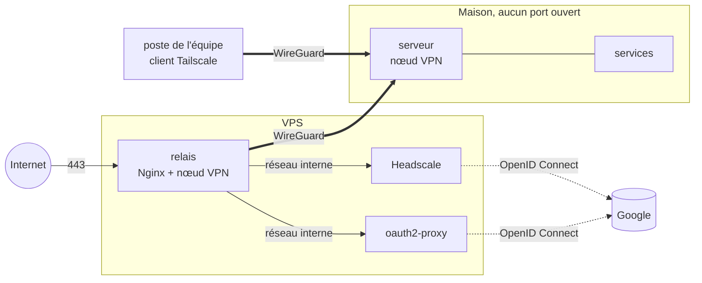

# CyberSas

Un sas entre Internet et mes machines. Une seule porte, un VPN pour l'équipe,
une connexion par compte Google, et rien d'autre d'ouvert.

> **En cours.** Le labo tourne en local et passe ses douze vérifications. Le
> déploiement sur un vrai VPS, avec un vrai domaine, viendra ensuite.

## Pourquoi

Héberger un service chez soi, c'est d'habitude ouvrir des ports sur sa box et
laisser son adresse IP à la vue de tous. Partager un dossier ou un serveur avec
quelques personnes, c'est souvent un mot de passe commun qui circule par
message, et que personne ne change jamais.

CyberSas prend le problème à l'envers :

- **Un seul point d'entrée public**, sur un petit VPS. Il termine le TLS, et ne
  publie que ce qui doit l'être.
- **Un VPN WireGuard pour l'équipe.** Chacun le rejoint avec son propre compte
  Google, second facteur compris. Aucun mot de passe n'est créé, stocké ni
  partagé ici.
- **Aucun port ouvert à la maison.** Le serveur de la maison sort vers le VPS par
  le VPN. Le VPS lui renvoie le trafic par le même chemin. La box reste fermée
  et l'adresse IP de la maison n'apparaît nulle part.

## Comment c'est fait



- **Nginx** est la seule chose qui écoute sur Internet. Un nom qu'il ne connaît
  pas n'obtient même pas de certificat : la connexion est coupée.
- **Headscale** est le serveur de coordination du VPN, la version libre et
  auto-hébergée de celui de Tailscale. Les appareils gardent les applications
  Tailscale officielles, mais c'est notre serveur qui décide qui entre. Pour
  rejoindre le réseau, on se connecte avec Google. Il porte aussi son propre
  relais DERP : même le trafic qui ne passe pas en direct ne transite pas par
  des serveurs tiers.
- **oauth2-proxy** protège les services web publiés. Avant chaque requête, Nginx
  lui demande si la personne est connectée avec un compte Google autorisé.
  Sinon, direction la page de connexion de Google.
- **Une seule liste d'accès**, `etat/equipe.txt` : une adresse Google et un
  groupe par ligne. Le VPN et les services web la lisent tous les deux, on ne
  peut pas oublier l'un des deux.
- **Les règles d'accès** sont dans [`headscale/politique.hujson`](headscale/politique.hujson).
  Tout est fermé par défaut. Les admins atteignent tout, l'équipe atteint les
  services web de la maison mais pas son SSH, et le serveur de la maison ne peut
  se retourner vers personne.
- **Trois réseaux Docker.** `public` pour le relais, `interne` sans passerelle
  entre Nginx et les services, et `sortie`, par lequel seuls Headscale et
  oauth2-proxy peuvent parler à Google.

Ce qu'on protège, contre qui, et ce qui se passe si le VPS tombe :
[`docs/menaces.md`](docs/menaces.md).

## Essayer le labo

Il faut Docker, avec Docker Compose, et Bash (Git Bash suffit sous Windows).

```bash
cp .env.exemple .env            # y mettre son adresse Google dans ADMIN_EMAIL
bash scripts/sas.sh init        # secrets, autorité du labo, liste d'accès
bash scripts/sas.sh demarrer    # la pile du VPS, et le relais inscrit au VPN
bash scripts/sas.sh labo        # une fausse maison et un poste d'essai
bash scripts/sas.sh essai       # vérifie que tout répond comme prévu
```

Sans client Google, tout tourne jusqu'à la page de Google, qui refusera
l'identifiant provisoire. Pour se connecter pour de vrai, voir la section
suivante.

Le labo utilise le domaine `127.0.0.1.nip.io`. C'est un vrai domaine public, qui
pointe vers la machine locale : Google l'accepte comme adresse de retour, ce
qu'il refuse pour un nom en `.test`. Le certificat vient d'une autorité propre
au labo, qui ne peut signer que pour ce domaine. Même installée sur un appareil,
elle ne pourrait pas servir à usurper un autre site. Pour ouvrir les pages
depuis un navigateur, importer `etat/ca/public/cybersas-ca.pem` comme autorité
de confiance.

## Brancher Google

Une fois, dans la [console Google Cloud](https://console.cloud.google.com/apis/credentials) :

1. Créer un projet, puis l'écran de consentement OAuth, en mode externe.
   Tant qu'il est en test, seules les adresses ajoutées comme testeurs
   peuvent se connecter.
2. Créer un identifiant **ID client OAuth**, de type **Application Web**, avec
   ces deux URI de redirection :
   - `https://hs.127.0.0.1.nip.io/oidc/callback`
   - `https://auth.127.0.0.1.nip.io/oauth2/callback`
3. Donner l'identifiant et le secret à CyberSas :

```bash
bash scripts/sas.sh google <id>.apps.googleusercontent.com <secret>
```

## Ajouter ou retirer quelqu'un

```bash
bash scripts/sas.sh membre alice@gmail.com equipe
bash scripts/sas.sh retirer alice@gmail.com
```

Retirer quelqu'un déconnecte aussi ses appareils déjà dans le VPN.

Côté appareil, Alice installe Tailscale, choisit un serveur personnalisé,
`https://hs.<domaine>`, et se connecte avec son compte Google.

## Ce qui reste à faire

- Let's Encrypt, le jour où le domaine sera acheté.
- Le déploiement sur le VPS : Debian, pare-feu, mises à jour automatiques.
- CrowdSec devant Nginx, pour bloquer les adresses qui insistent.
- Les journaux de Nginx, Headscale et oauth2-proxy envoyés vers un SIEM, avec
  des alertes.
- Un espace de fichiers partagé, accessible seulement par le VPN.
