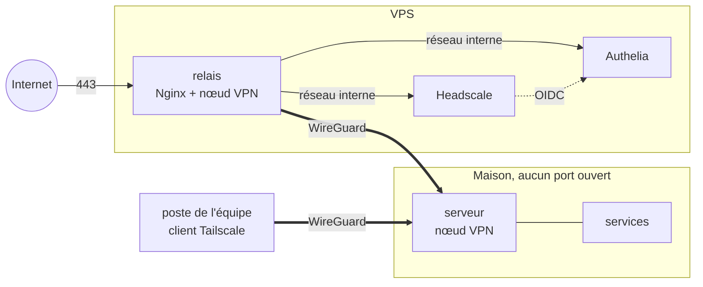

# CyberSas

Un sas entre Internet et mes machines. Une seule porte, un VPN pour l'équipe,
et rien d'autre d'ouvert.

> **En cours.** Le labo tourne en local. Le déploiement sur un vrai VPS, avec
> un vrai domaine, viendra ensuite.

## Pourquoi

Héberger un service chez soi, c'est d'habitude ouvrir des ports sur sa box et
laisser son adresse IP à la vue de tous. Partager un dossier ou un serveur avec
quelques personnes, c'est souvent un mot de passe commun qui circule par
message, et que personne ne change jamais.

CyberSas prend le problème à l'envers :

- **Un seul point d'entrée public**, sur un petit VPS. Il termine le TLS, et ne
  publie que ce qui doit l'être.
- **Un VPN WireGuard pour l'équipe.** Chacun rejoint le réseau avec son propre
  compte, un mot de passe et un second facteur. Personne ne partage d'identifiant.
- **Aucun port ouvert à la maison.** Le serveur de la maison sort vers le VPS par
  le VPN. Le VPS lui renvoie le trafic par le même chemin. La box reste fermée
  et l'adresse IP de la maison n'apparaît nulle part.

## Comment c'est fait



- **Nginx** est la seule chose qui écoute sur Internet. Un nom qu'il ne connaît
  pas n'obtient même pas de certificat : la connexion est coupée. Les tentatives
  de connexion sont limitées à dix par minute et par adresse.
- **Headscale** est le serveur de coordination du VPN, la version libre et
  auto-hébergée de celui de Tailscale. Les appareils gardent les applications
  Tailscale officielles, mais c'est notre serveur qui décide qui entre. Il porte
  aussi son propre relais DERP : même le trafic qui ne passe pas en direct ne
  transite pas par des serveurs tiers.
- **Authelia** gère l'identité. Rejoindre le VPN passe par elle, second facteur
  compris. Les services web publiés passent aussi par elle : Nginx lui demande,
  avant chaque requête, si la personne a le droit d'entrer.
- **Les règles d'accès** sont dans [`headscale/politique.hujson`](headscale/politique.hujson).
  Tout est fermé par défaut. Les admins atteignent tout, l'équipe atteint les
  services web de la maison mais pas son SSH, et le serveur de la maison ne peut
  se retourner vers personne.
- **Headscale et Authelia n'ont aucune sortie.** Leur réseau Docker est interne,
  sans passerelle. Seul Nginx peut leur parler.

Ce qu'on protège, contre qui, et ce qui se passe si le VPS tombe :
[`docs/menaces.md`](docs/menaces.md).

## Essayer le labo

Il faut Docker, avec Docker Compose, et Bash (Git Bash suffit sous Windows).

```bash
cp .env.exemple .env
bash scripts/sas.sh init        # secrets, autorité du labo, premier compte admin
bash scripts/sas.sh demarrer    # la pile du VPS, et le relais inscrit au VPN
bash scripts/sas.sh labo        # une fausse maison et un poste d'essai
bash scripts/sas.sh essai       # vérifie que tout répond comme prévu
```

`init` affiche une seule fois le mot de passe provisoire du compte admin.

Le labo n'a pas de vrai domaine : il utilise `cybersas.test`, un nom réservé aux
essais, et sa propre autorité de certification. Cette autorité ne peut signer
que pour `cybersas.test` et ses sous-domaines. Même installée sur un appareil,
elle ne pourrait pas servir à usurper un autre site.

Pour ouvrir les pages depuis un navigateur, ajouter au fichier `hosts` :

```
127.0.0.1  hs.cybersas.test auth.cybersas.test maison.cybersas.test
```

puis importer `etat/ca/public/cybersas-ca.pem` comme autorité de confiance.

## Ajouter quelqu'un

```bash
bash scripts/sas.sh utilisateur alice alice@exemple.fr "Alice" equipe
```

Le mot de passe provisoire s'affiche une fois. Il faut aussi ajouter `alice@`
dans `group:equipe` de la politique, puis `bash scripts/sas.sh politique`.

Côté appareil, Alice installe Tailscale, choisit un serveur personnalisé,
`https://hs.<domaine>`, et se connecte avec son compte. Le second facteur se
règle à la première connexion.

## Ce qui reste à faire

- Let's Encrypt, le jour où le domaine sera acheté.
- Le déploiement sur le VPS : Debian, pare-feu, mises à jour automatiques.
- CrowdSec devant Nginx, pour bloquer les adresses qui insistent.
- Les journaux de Nginx, Headscale et Authelia envoyés vers un SIEM, avec des
  alertes.
- Un espace de fichiers partagé, accessible seulement par le VPN.
