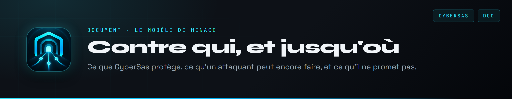
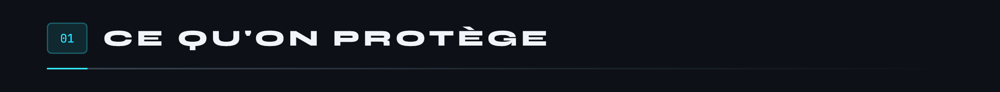
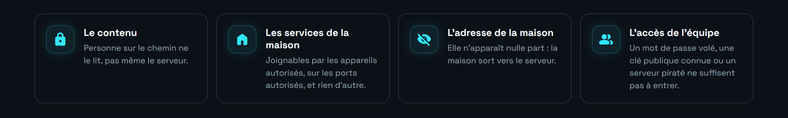
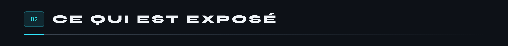
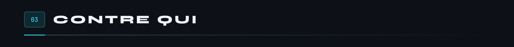
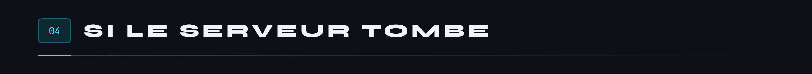
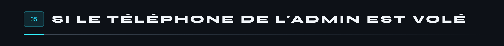
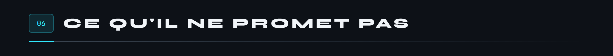

 

Ce que CyberSas protège, contre qui, et ce qu'il ne promet pas. Chaque affirmation renvoie à un mécanisme décrit dans [`protocole.md`](protocole.md) ou [`verrou.md`](verrou.md), et la plupart à un test.

[Ce qu'on protège](#ce-qu-on-protege) · [Ce qui est exposé](#ce-qui-est-expose) · [Contre qui](#contre-qui) · [Si le serveur tombe](#si-le-serveur-tombe) · [Si le téléphone de l'admin est volé](#si-le-telephone-est-vole) · [Ce qu'il ne promet pas](#ce-qu-il-ne-promet-pas)

- **UDP 51820**, le tunnel. Il ne répond qu'à une initiation portant un mac1 valide, donc calculé avec la clé publique du serveur, que seuls les appareils inscrits connaissent, et venant d'une clé inscrite. À tout le reste, il ne répond rien : un scan ne voit qu'un port muet.
- **TCP 443**, pour trois noms : `vpn.` (l'API d'inscription), `auth.` (la connexion Google des pages web) et `maison.` (un service publié). Tout autre nom est coupé avant même l'échange de certificat.
- **TCP 80**, qui ne fait que rediriger.

Quelques précisions que les fiches ne disent pas :

- **Qui veut s'approprier l'appareil d'un autre.** Les clés publiques circulent, mais inscrire une clé demande de prouver qu'on détient sa moitié privée. Et une clé inscrite ne change jamais de propriétaire.
- **Un membre qui va trop loin**, volontairement ou parce que son appareil est compromis. Le serveur ne relaie pas vers les appareils sans relation avec lui, et ceux qui en ont filtrent eux-mêmes ce qui entre. Il ne peut pas prendre le nom d'une machine ou du serveur dans le DNS du VPN, ni écrire lui-même les en-têtes d'identité qu'un service publié croit : le port publié n'est ouvert qu'au serveur.
- **Un service de la maison compromis.** Il ne peut se retourner vers aucun appareil : aucune règle ne part de `etiquette:maison`, et les appareils refusent ce qu'il tenterait d'ouvrir chez eux.
- **Un compte Google d'admin volé.** Il permet d'inscrire un appareil, pas d'en faire un appareil d'admin : les routes d'admin exigent un certificat signé par le verrou pour le groupe `admins`.

C'est le cas le plus grave. Grâce au bout en bout et au verrou, il reste borné. Tout ce qui suit suppose le verrou en place ; sans lui, le serveur est cru sur parole.

Deux points à savoir :

- Un appareil qui n'a jamais vu une nouvelle révocation ne peut pas l'appliquer : c'est la raison d'être de l'expiration des certificats.
- Pour les pages publiées sur `maison.`, le TLS se termine sur le VPS. Passer par le VPN plutôt que par la page publique garde le chiffrement de bout en bout.

Depuis que l'admin signe depuis son téléphone, ce téléphone compte autant que le serveur. Voici ce qui le protège, et ce qu'il faut faire s'il disparaît.

Un voleur qui trouve le téléphone verrouillé n'a rien. S'il le trouve déverrouillé, l'appli lui demande une empreinte ; s'il la trouve ouverte, il peut voir le réseau et créer une invitation, pour un membre déjà dans l'équipe seulement ; retirer, signer ou révoquer demandent encore le doigt de l'admin.

Les relectures, leurs constats et ce qui en a été fait : [`audit.md`](audit.md).

 

<a href="../README.md">Retour au README</a> · <a href="protocole.md">Le protocole</a> · <a href="verrou.md">Le verrou</a> · <a href="audit.md">L'audit</a>

