

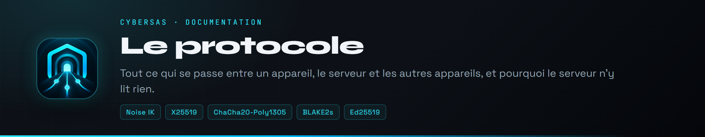

 

Tout ce qui se passe entre un appareil, le serveur et les autres appareils, octet par octet. Le code vit dans `internal/` : `noise`, `tunnel`, `protocole`, `verrou` et `client`.

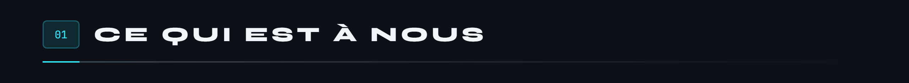

Les primitives cryptographiques viennent de la bibliothèque standard de Go et de `golang.org/x/crypto`. On n'écrit jamais ses propres primitives.

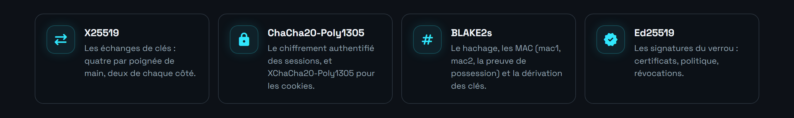

Tout le reste est écrit ici : l'assemblage de la poignée de main, le format des messages, les sessions, le relais, la protection contre le rejeu et l'inondation, le filtre, le verrou.

L'architecture reprend celle de WireGuard, qui a fait ses preuves, et celle de Tailscale pour le relais et le verrou. Mais le code est le nôtre, et il n'est **pas compatible** avec WireGuard : le prologue et le format diffèrent.

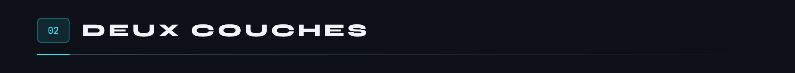


Deux couches, toutes deux des poignées de main Noise IK :

- **La couche transport** : chaque appareil a une session avec le serveur, en UDP direct. Elle transporte ce qui s'adresse au serveur lui-même (le DNS du réseau) et les trames de relais.
- **La couche de bout en bout** : chaque paire d'appareils qui a le droit de se parler a sa propre session. Un paquet de A vers B est chiffré avec la session A-B, glissé dans une trame de relais, chiffrée à son tour pour le serveur. Le serveur ouvre la trame, lit le numéro du destinataire, et la remet à B dans sa propre session. Le paquet lui-même lui reste illisible : il n'a pas les clés de la session A-B.

Une session de bout en bout ne s'ouvre qu'à la demande, au premier paquet. Celle avec le serveur reste toujours ouverte : c'est par elle que les autres appareils nous joignent.

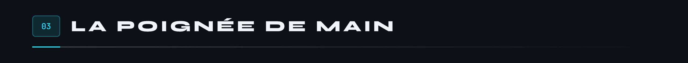

`Noise_IK_25519_ChaChaPoly_BLAKE2s`, écrit d'après la [spécification Noise](https://noiseprotocol.org/noise.html), révision 34, avec le prologue `CyberSas tunnel v2`.

L'initiateur connaît d'avance la clé publique statique de l'autre (le **K** de IK) : le serveur la donne à l'inscription, puis dans l'état du réseau pour les autres appareils. Il envoie la sienne, chiffrée, dans le premier message (le **I**). Un seul aller-retour établit deux clés de session, une par sens.

Ce qui prouve que c'est juste :

- les vecteurs de test officiels du projet Noise (cacophony), pour cette variante exacte : les deux messages, le hachage final et quatre messages de transport correspondent octet pour octet ;
- l'échange dans les deux sens avec [flynn/noise](https://github.com/flynn/noise), une implémentation indépendante ;
- un octet modifié n'importe où dans le premier message le fait refuser.

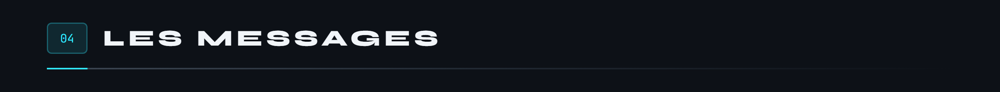

Tous commencent par un octet de type et trois octets réservés, à zéro. Les entiers sont en petit-boutiste, sauf la longueur d'une trame de relais. Chaque case est dessinée à l'échelle de ses octets.

- Le clair d'un message de données est soit un paquet IPv4 (premier octet `0x4X`), soit une trame de relais (premier octet `0x00`), soit vide (un maintien).
- Le message d'une trame de relais est une initiation, une réponse ou des données de la couche de bout en bout. Le numéro désigne le destinataire quand la trame va au serveur, et l'expéditeur quand elle en revient. La longueur permet d'écarter le remplissage ajouté par la couche transport.
- Le serveur ne relaie que des initiations, réponses et données : jamais un cookie, jamais une trame dans une trame.
- Les indices sont tirés au hasard par chaque côté. Ils permettent de retrouver une session sans rien révéler de l'identité de l'appareil.

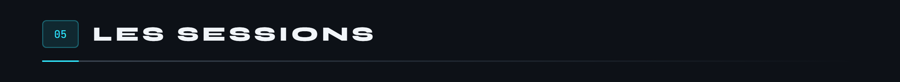


- Le compteur d'un paquet de données sert de nonce ChaCha20-Poly1305 : quatre octets nuls, puis le compteur sur huit octets.
- Le clair est complété par des zéros jusqu'à un multiple de 16 octets. La longueur réelle se lit dans l'en-tête IP, ou dans celui de la trame.
- L'initiateur renouvelle sa session toutes les **deux minutes**. Une session de plus de **trois minutes** ne chiffre et ne déchiffre plus rien.
- Le répondeur n'utilise une nouvelle session qu'après avoir reçu un premier paquet de données chiffré avec elle : c'est la preuve que l'initiateur détient les mêmes clés.
- **MTU** de l'interface : 1 360 octets. Le pire cas, un paquet relayé, tient ainsi dans 1 500 octets même sur IPv6.

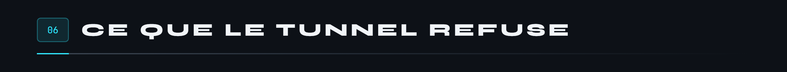

Deux de ces refus méritent un mot de plus :

- **Le mauvais chemin.** Le serveur ne peut pas faire passer un appareil pour un autre : il relaierait sous un numéro, mais la clé de la session ne correspondrait pas.
- **Pas pour nous.** Sans cette vérification, un pair autorisé sur un port pourrait se servir d'un appareil comme routeur vers son réseau local. C'était le constat T1 du premier audit.

Repris de WireGuard. Une poignée de main coûte deux échanges X25519 : on trie avant.

- **mac1** : un MAC BLAKE2s de 16 octets sur le message, avec une clé tirée de la clé publique du destinataire. Or la clé publique du serveur n'est donnée qu'aux appareils inscrits.
- **Sous charge** (plus de 200 poignées de main par seconde), le serveur exige aussi un **mac2** valide, calculé avec un cookie. Sinon, il répond par un message cookie : un MAC de l'adresse IP et du port de l'expéditeur, sous un secret renouvelé toutes les deux minutes, chiffré en XChaCha20-Poly1305 avec le mac1 reçu en données associées. Seul celui qui reçoit vraiment les paquets envoyés à son adresse peut s'en servir.
- Une adresse qui a prouvé la possession de son IP garde droit à **dix poignées de main par seconde**. Le seau est celui de son réseau : /32 en IPv4, /64 en IPv6, pour que posséder un /64 ne donne pas des milliards de seaux.

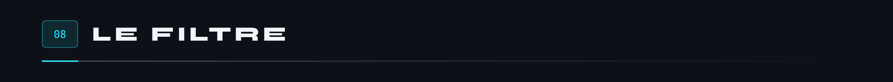

Le serveur ne voit plus les paquets entre appareils : il ne peut plus appliquer les règles d'accès. C'est donc l'appareil qui reçoit qui filtre.

- **Sans verrou**, avec les règles que le serveur lui transmet. **Avec verrou**, avec les règles qu'il **calcule lui-même** à partir de la politique signée et des certificats signés : le serveur ne peut alors ni ouvrir un port, ni changer à qui une règle s'applique.
- Ce qu'un appareil envoie n'est jamais filtré.
- Seule la réponse d'écho peut revenir d'une demande d'écho ICMP.
- Répondre à ce qu'une règle laisse déjà entrer ne consomme rien du budget d'un pair : il ne peut pas remplir la table au détriment des autres.
- Un fragment qui n'est pas le premier n'a pas d'en-tête de transport : il ne passe qu'avec une règle « tout ».

En plus du filtre, le serveur ne relaie qu'entre deux appareils que la politique relie, dans un sens au moins. Deux appareils sans relation ne peuvent même pas se faire une poignée de main.

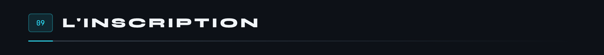

1. L'appareil tire sa paire de clés X25519. La clé privée ne le quitte jamais, pas même dans une sauvegarde Android.
2. Il demande la clé publique du serveur (`GET /api/v1/serveur`).
3. Il calcule une **preuve de possession** : un HMAC-BLAKE2s, avec pour clé le secret X25519 entre sa clé et celle du serveur, sur toute la demande (les deux clés publiques, l'horodatage, le justificatif, le nom et le système). Seul le détenteur de la clé privée peut la produire, et elle ne se recolle pas à une autre demande. Le serveur refuse une preuve fausse, vieille de plus de cinq minutes, ou qui a déjà servi.
4. Il l'envoie avec un justificatif : une clé d'inscription à usage unique (le lien d'invitation), ou un jeton d'identité Google.
5. Le serveur vérifie le justificatif (pour Google : signature, émetteur, expiration, destinataire, partie autorisée, adresse vérifiée, présence dans l'équipe). À la première inscription d'une adresse, il retient l'identifiant permanent du compte Google : une adresse recyclée n'ouvre pas l'accès de l'ancien titulaire. Il attribue une adresse `10.77.0.x` et un numéro, jamais redonnés tout de suite à un autre appareil.

Le lien d'invitation porte la clé publique du verrou : le nouvel appareil la connaît avant même son premier contact avec le serveur. Et le serveur qu'il annonce ne peut router qu'une plage privée, pas plus large qu'un /16, avec un domaine sous `.internal` : un lien forgé ne détourne pas tout l'Internet du téléphone.

Une clé déjà inscrite ne change jamais de propriétaire ni d'étiquette. Le nom d'une machine est fixé par l'admin ; celui d'un appareil personnel porte toujours le nom de son propriétaire (`portable-alice`), pour que personne ne prenne celui d'une machine ou du serveur.

Toutes les clés, signatures et preuves reçues sont décodées par un décodeur base64 **canonique** (`internal/b64`) : une valeur n'a qu'une écriture acceptée. Le décodeur standard en accepte plusieurs, et un serveur piraté s'en serait servi pour faire passer une clé révoquée.

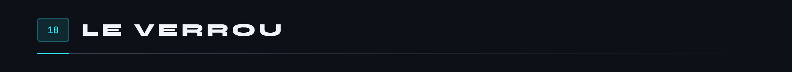

Le chiffrement de bout en bout empêche le serveur de lire. Mais c'est lui qui distribue les clés publiques et les règles : un serveur piraté pourrait annoncer sa propre clé sous le nom d'un appareil, s'ouvrir les ports de tous, ou faire revenir un appareil banni. Le verrou ferme ces portes.

L'admin a une clé de signature **Ed25519**, gardée hors du serveur. Il signe trois sortes de documents, chacune avec son propre contexte, pour qu'une signature faite pour l'une ne serve jamais pour une autre. Chaque texte est précédé de sa longueur.

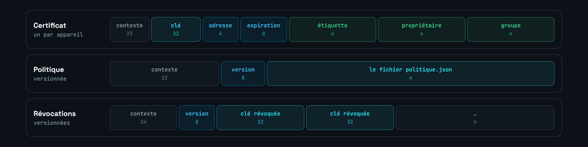

- **Le certificat** contient tout ce qui décide des règles d'un appareil : le serveur ne peut ni déplacer une clé signée vers une autre adresse, ni changer son étiquette ou son groupe. Il expire au bout de 90 jours.
- **La politique** est signée octet pour octet, avec son numéro de version.
- **La liste des clés révoquées** est triée, avec son numéro de version.

Chaque appareil retient la clé publique du verrou à l'inscription. Ensuite :

- il refuse tout pair sans certificat valide, expiré, ou révoqué, même présenté par le serveur ;
- il calcule ses règles d'entrée lui-même, à partir de la politique signée et des certificats, dont le sien : sans certificat pour lui-même, rien n'entre ;
- il n'accepte jamais une politique ou une liste de révocation plus ancienne que la dernière vue, et garde les versions vues sur disque ;
- il refuse tout changement ou toute disparition du verrou, et de la clé du serveur, même en se réinscrivant, sauf si on le lui demande explicitement.

Comment on s'en sert, où vit la clé et comment le téléphone la protège : [le document du verrou](verrou.md).

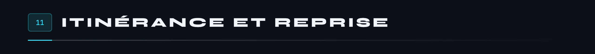

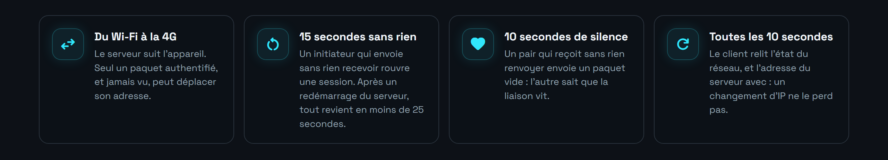

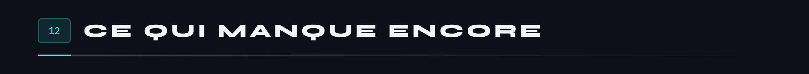

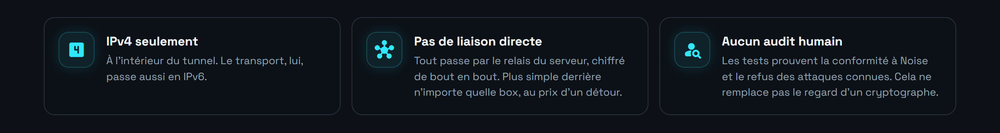

Les relectures automatiques, leurs constats et ce qui en a été fait sont dans [l'audit](audit.md).

 

<a href="../README.md">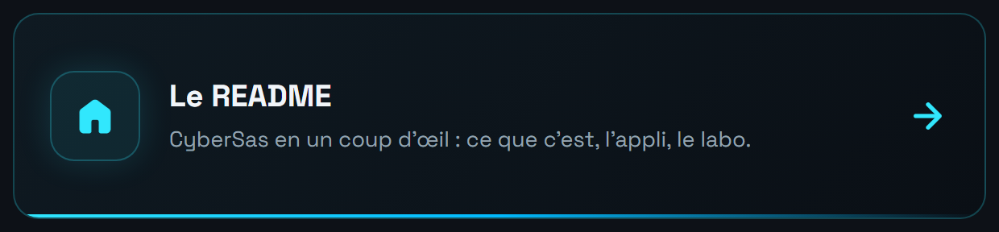</a>
<a href="verrou.md">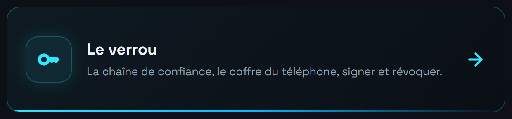</a>
<a href="menaces.md">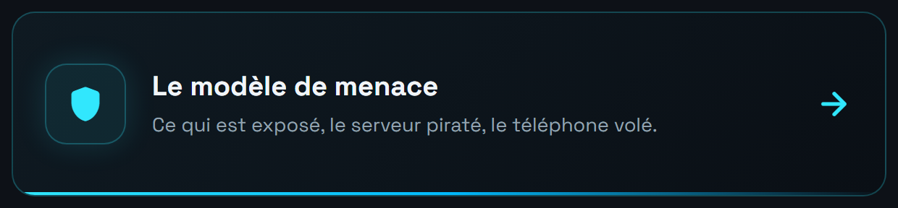</a>
<a href="audit.md">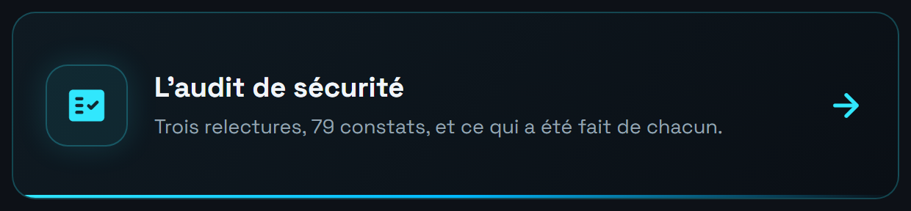</a>

