<div align="center">

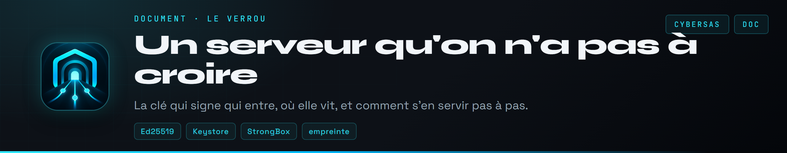

</div>

<br>

Le verrou protège le réseau contre son propre serveur. Avec lui, un serveur piraté ne peut ni s'intercaler entre deux appareils, ni leur ouvrir des ports, ni faire revenir un appareil banni. Le principe est décrit dans [`protocole.md`](protocole.md) ; ce document dit où vit la clé et comment s'en servir.

[La règle d'or](#la-regle-d-or) · [La chaîne de confiance](#la-chaine-de-confiance) · [Le coffre du téléphone](#le-coffre-du-telephone) · [Créer le verrou](#creer-le-verrou) · [Signer un appareil](#signer-un-appareil) · [Signer la politique](#signer-la-politique) · [Bannir un appareil](#bannir-un-appareil) · [Perte ou vol](#si-la-cle-est-perdue-ou-volee)

<a name="la-regle-d-or"></a>
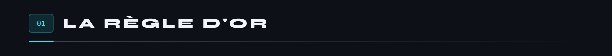

**La clé privée du verrou ne touche jamais le serveur.** Le serveur ne reçoit que des documents déjà signés, qu'il transmet sans pouvoir les modifier. La clé, elle, vit à deux endroits au plus, tous deux chez l'admin :

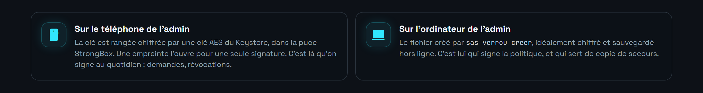

Dans le labo, tout tient sur une machine, clé comprise : c'est commode pour essayer, et c'est la seule exception.

<a name="la-chaine-de-confiance"></a>
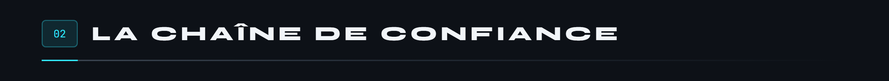


Le serveur est un facteur : il porte les lettres, il ne peut pas les réécrire. Et comme chaque appareil garde la plus haute version vue de la politique et des révocations, il ne peut pas non plus ressortir une vieille lettre plus arrangeante.

<a name="le-coffre-du-telephone"></a>
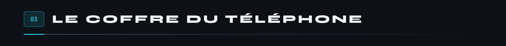


Le code est dans [`Coffre.kt`](../mobile/android/app/src/main/kotlin/fr/cybersas/cybersas/Coffre.kt) et [`MainActivity.kt`](../mobile/android/app/src/main/kotlin/fr/cybersas/cybersas/MainActivity.kt).

- **Une empreinte, une opération.** La clé AES du Keystore n'a aucune durée de validité : elle n'accepte que le chiffreur que l'invite biométrique vient d'authentifier. Déverrouiller le téléphone au doigt ne suffit donc pas à ouvrir le coffre dix secondes plus tard.
- **Une empreinte forte.** L'invite n'accepte que la biométrie de classe forte : pas un visage de classe faible, pas le code du téléphone.
- **Ce qu'on signe est affiché avant.** L'invite reprend le nom, l'empreinte, l'adresse et le groupe de l'appareil. Et le moteur ne signe que les fiches montrées : si le serveur en a changé un champ depuis l'affichage, rien n'est signé.
- **Pas de copie.** Le fichier chiffré et la clé de l'appareil sont exclus des sauvegardes Google et des transferts d'un téléphone à l'autre. La clé AES, elle, ne quitte jamais la puce.
- **Ranger la clé** : Réglages, Clé du verrou. On la colle, l'appli vérifie que c'est bien celle du verrou retenu, puis demande l'empreinte et la range. Le presse-papiers est vidé quoi qu'il arrive.

Ce qui reste, et qui est dit tel quel : la clé déchiffrée passe un instant dans une chaîne de caractères de Kotlin et de Go, qu'on ne peut pas effacer de la mémoire. Seuls les tableaux d'octets sont remis à zéro.

<a name="creer-le-verrou"></a>
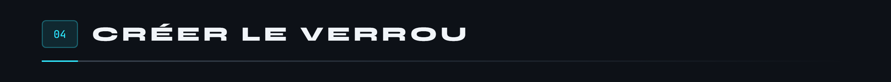

Sur l'ordinateur de l'admin :

```bash
sas verrou creer --fichier ~/.cybersas/verrou
```

La commande affiche la clé publique et son empreinte. La clé publique se pose sur le serveur, dans `etat/verrou/publique`. La clé privée reste où elle est : `sas verrou creer` ne remplace jamais une clé existante. Pour signer depuis le téléphone, on colle ensuite son contenu dans l'appli (Réglages, Clé du verrou).

<a name="signer-un-appareil"></a>


**Depuis le téléphone**, c'est le chemin normal : la demande apparaît dans l'onglet Appareils. L'admin compare l'empreinte avec celle affichée sur le nouvel appareil, relit ce qu'il signe (adresse, groupe, propriétaire, 90 jours), puis pose son doigt.


**Depuis l'ordinateur**, pour une machine sans écran comme le serveur de la maison :

1. L'admin crée une clé d'inscription sur le serveur : `docker compose exec sasd sasd cle --etiquette maison --nom maison`.
2. L'appareil s'inscrit, en recevant la clé publique du verrou d'avance : `SAS_CLE=sas-... sas rejoindre --serveur https://vpn.exemple.fr --verrou <clé publique du verrou>`. Il affiche sa propre clé publique et son empreinte.
3. L'admin lit cette clé **sur l'appareil lui-même** (à l'écran, ou par `sas etat`), jamais sur le serveur. Puis il signe cette clé-là, et elle seule :

```bash
ssh vps 'docker compose exec -T sasd sasd appareils --json' \
  | sas verrou signer --fichier ~/.cybersas/verrou --cle <clé publique de l'appareil> \
  | ssh vps 'docker compose exec -T sasd sasd signatures'
```

`sas verrou signer` affiche ce qu'il signe : nom, adresse, étiquette ou propriétaire, groupe et empreinte. Si l'empreinte ne correspond pas à celle affichée par l'appareil, il ne faut rien envoyer.

Les certificats valent 90 jours (`--duree` pour changer). Il faut les renouveler avant, de la même façon.

<a name="signer-la-politique"></a>
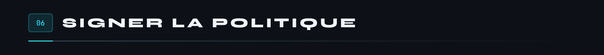

À chaque modification de `politique/politique.json`, augmenter son champ `version`, puis :

```bash
sas verrou politique --fichier ~/.cybersas/verrou < politique/politique.json > politique/politique.sig
```

Poser les deux fichiers sur le serveur. Les appareils refusent une politique mal signée, ou plus ancienne que la dernière qu'ils ont vue.

<a name="bannir-un-appareil"></a>
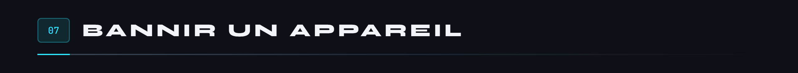


**Retirer** un appareil le coupe tout de suite, mais son certificat reste valide jusqu'à expiration : retiré seulement, il pourrait se réinscrire. Pour un appareil volé ou perdu, il faut le **révoquer**.

**Depuis le téléphone** : le détail de l'appareil, Révoquer. Le dialogue montre son empreinte et son adresse, pas seulement son nom, que le serveur choisit. Après l'empreinte, le téléphone part de la liste qu'il a retenue, y ajoute celle que sert le serveur **seulement si elle est signée par le verrou**, ajoute l'appareil, signe la version suivante et l'envoie. Le serveur vérifie la signature, que la version est plus récente, et que rien n'a été oublié, puis la garde dans `revocations.json`.

**Depuis l'ordinateur** :

```bash
ssh vps 'docker compose exec -T sasd sasd revocations' \
  | sas verrou revoquer --fichier ~/.cybersas/verrou --cle <clé publique de l'appareil> \
  | ssh vps 'cat > etat/sasd/revocations.json'
```

`sas verrou revoquer` refuse une liste actuelle qui n'est pas signée par ce verrou, et affiche toute la liste qu'il signe, pas seulement ce qui s'ajoute.

La liste est numérotée : les appareils gardent la plus récente vue, et n'acceptent jamais d'en revenir à une plus ancienne.

<a name="si-la-cle-est-perdue-ou-volee"></a>
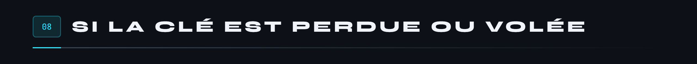

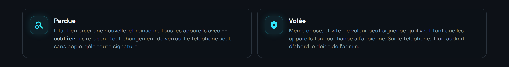

C'est pour cela qu'un secours pour la clé du verrou est dans la feuille de route : en attendant, garder une copie chiffrée hors ligne du fichier de l'ordinateur.

<br>

<div align="center">
<sub><a href="../README.md">Retour au README</a> · <a href="protocole.md">Le protocole</a> · <a href="menaces.md">Le modèle de menace</a> · <a href="audit.md">L'audit</a></sub>
</div>
